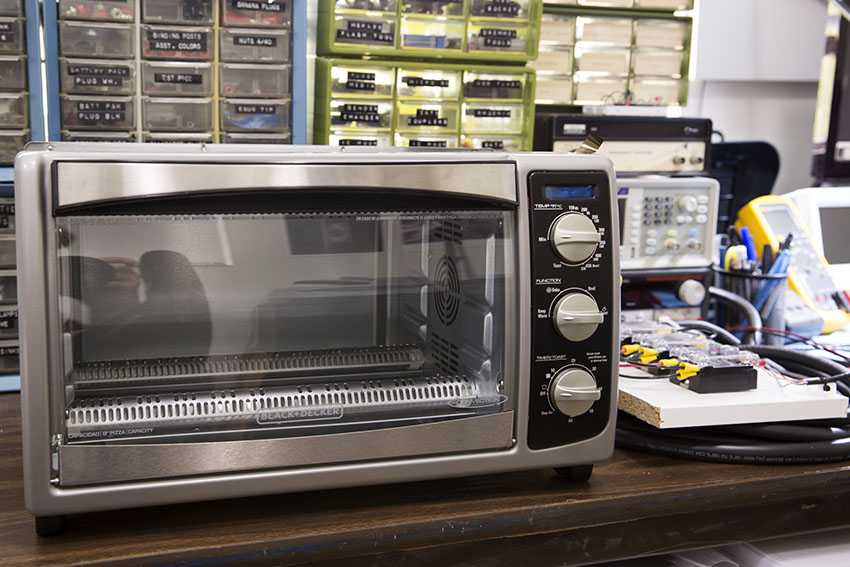
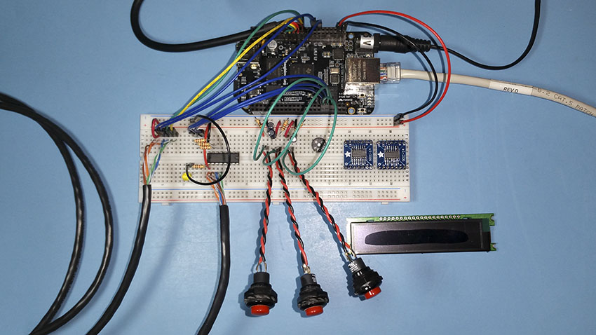
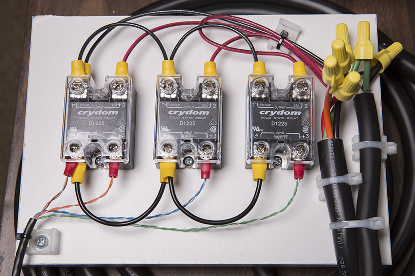

# ROC-200: Dual Element Reflow Oven Controller

**Status:** Discontinued

The ROC-200 is a hardware controller that converts a consumer toaster oven
into a reflow soldering oven. It supports independent control of two sets of
heating elements (top and bottom) and temperature sensing with two thermocouples.

***WARNING:*** *The toaster oven listed in this project's BOM contains aluminum
wiring. Connecting aluminum and copper wires together is a fire hazard.*

This project has been discontinued because it is no longer economical. The
[T962 Reflow Oven](https://www.amazon.com/SMTHouse-Infrared-Soldering-Machine-Automatic/dp/B0152FTXN2/ref=sr_1_3?ie=UTF8&qid=1541304821&sr=8-3&keywords=t962+reflow+oven)
can be purchased for less than the cost of this project's components, and is
probably safer to operate.

## Directory Structure

* `/app` - SBC application ([Nerves](http://nerves-project.org/))
* `/cad` - Assembly & part drawings
* `/design` - General design documentation
* `/schematics` - Electrical schematics & PCB drawings ([Eagle](https://www.autodesk.com/products/eagle/free-download))

## Documentation

Working documentation is located in the `/design` and `/schematics` folders.
Since the project is currently being designed and prototyped, files are
currently only available for the editors they were created in. This eliminates
the need to commit derivatives of rapidly changing binary files during this
phase of the project. When the design stabilizes, more compatible formats of
these files, like PDF and JPG, will be added.

## Development

The embedded controller for this project is powered by Nerves. For more
information see the [Nerves Project](https://nerves-project.org/) documentation.
